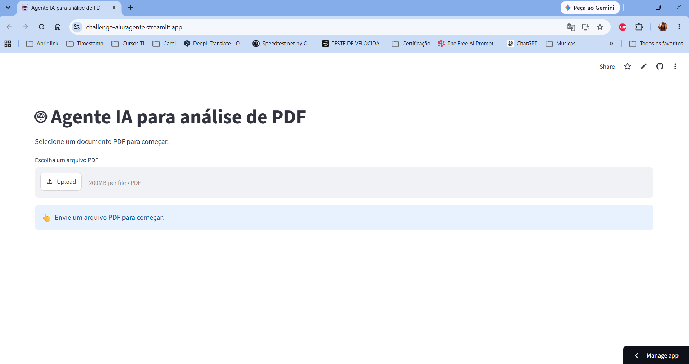

# Challenge Alura Agente

## 🚀 Aplicação

👉 [Acesse a aplicação](https://challenge-aluragente.streamlit.app/)

## 📋 Sobre o projeto

O objetivo é desenvolver um agente de inteligência artificial que consiga responder a perguntas sobre o documento escolhido (PDF), buscando as informações e devolvendo-as de forma clara.

A melhor arquitetura para um agente de IA é RAG (Retrieval-Augmented Generation), utilizando pdfplumber + Sentence Transformers + FAISS + um modelo gerativo da Hugging Face. É significativamente
mais preciso do que passar todo o PDF como contexto.

Arquitetura do agente:
1. O usuário envia um PDF.
2. O PDF é convertido em texto.
3. O texto é dividido em pequenos trechos (chunks).
4. Cada trecho recebe um embedding vetorial.
5. A pergunta é convertida em embedding.
6. O FAISS encontra os trechos mais relevantes.
7. Um modelo de linguagem gera a resposta apenas com aquele contexto.

O agente, neste exemplo, acessa o documento "Política de Atendimento, trocas, devoluções e privacidade.pdf" do Mercado Central 24h.

## 🛠️ Ferramentas e tecnologias utilizadas

Para o desenvolvimento deste projeto foram utilizadas diferentes ferramentas e bibliotecas para construção da aplicação, processamento dos documentos, geração de embeddings e implementação do modelo de inteligência artificial.

🐍 Python

Linguagem principal utilizada no desenvolvimento da aplicação, responsável pela integração entre as diferentes bibliotecas e componentes do projeto.

🎈 Streamlit

Framework utilizado para criar a interface web da aplicação de forma simples e interativa, permitindo que o usuário envie documentos e interaja com o sistema.

📄 PDFPlumber

Biblioteca utilizada para realizar a leitura e extração de textos presentes nos arquivos PDF utilizados pelo projeto.

🔢 NumPy

Biblioteca utilizada para operações numéricas e manipulação dos dados gerados durante o processamento.

🔎 FAISS

Biblioteca utilizada para indexação e busca eficiente de vetores. No projeto, é utilizada para encontrar os conteúdos mais relevantes a partir dos embeddings gerados.

🧠 Sentence Transformers

Utilizada para transformar os textos em embeddings, representações numéricas que permitem comparar semanticamente os conteúdos dos documentos.

🤗 Hugging Face Transformers

Biblioteca utilizada para carregar e executar o modelo de linguagem responsável pela geração das respostas.

🤖 Google FLAN-T5

Modelo de linguagem utilizado na aplicação para gerar respostas a partir dos conteúdos relevantes recuperados dos documentos.

🔥 PyTorch

Framework utilizado como base para execução do modelo de linguagem e processamento necessário para o funcionamento do FLAN-T5.

🔗 Git e GitHub

Utilizados para controle de versão, armazenamento do código-fonte e acompanhamento do desenvolvimento do projeto.

📌 Resumo

A combinação dessas tecnologias permite implementar um fluxo de perguntas e respostas baseado em documentos, utilizando técnicas de processamento de linguagem natural, embeddings e busca vetorial para recuperar informações relevantes antes da geração das respostas.

## 🖥️ Interface da aplicação

A aplicação possui uma interface desenvolvida com Streamlit, proporcionando uma experiência simples, intuitiva e interativa para o usuário.

A interface permite realizar o upload de documentos em formato PDF e utilizar o conteúdo desses documentos como base para realizar perguntas e obter respostas.

📄 Upload de documentos

O usuário pode selecionar e enviar um arquivo PDF diretamente pela interface. Após o carregamento, o sistema realiza a leitura e o processamento do conteúdo do documento.

💬 Interação com o documento

Depois que o documento é processado, o usuário pode fazer perguntas relacionadas ao seu conteúdo. A aplicação utiliza técnicas de processamento de linguagem natural e busca semântica para localizar informações relevantes no documento.

🤖 Geração de respostas

As informações relevantes encontradas são utilizadas como contexto para o modelo de linguagem, que gera uma resposta relacionada à pergunta realizada pelo usuário.

🔄 Fluxo da aplicação

O funcionamento da interface segue um fluxo simples:

Upload do PDF → Processamento do documento → Busca das informações relevantes → Geração da resposta → Exibição para o usuário

O objetivo da interface é tornar a interação com documentos mais prática, permitindo que o usuário consulte seu conteúdo por meio de perguntas em linguagem natural, sem a necessidade de realizar buscas manuais no arquivo.

## 💬 Exemplo de interação

A aplicação permite que o usuário faça perguntas em linguagem natural sobre o conteúdo de um documento PDF enviado previamente.

Após realizar o upload do arquivo, o sistema processa o conteúdo e utiliza busca semântica para identificar os trechos mais relevantes para responder à pergunta.

## 📄 Exemplo

Documento: documento.pdf

Pergunta:

Qual é o principal objetivo apresentado no documento?

Resposta da aplicação:

O principal objetivo apresentado no documento é utilizar os dados e informações disponíveis para apoiar a análise e auxiliar na tomada de decisões.

🔎 Outros exemplos de perguntas

O usuário também pode realizar perguntas como:

Quais são os principais pontos abordados no documento?
Qual é o objetivo do projeto apresentado?
Quais problemas são identificados no documento?
Quais soluções são propostas?
Quais são as principais conclusões apresentadas?
Quais informações são apresentadas sobre determinado tema?
🤖 Fluxo de pergunta e resposta

A interação acontece da seguinte maneira:

1. Upload do documento
O usuário envia um arquivo PDF pela interface.

2. Processamento
O sistema extrai e processa o texto presente no documento.

3. Pergunta
O usuário realiza uma pergunta relacionada ao conteúdo.

4. Busca semântica
A aplicação identifica os trechos do documento mais relevantes para a pergunta.

5. Geração da resposta
O modelo de linguagem utiliza essas informações como contexto e gera uma resposta.

6. Exibição
A resposta é apresentada diretamente na interface da aplicação.

💡 Dica: para obter melhores resultados, recomenda-se fazer perguntas diretamente relacionadas ao conteúdo presente no documento enviado.
